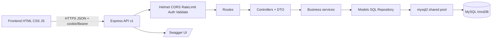

# Arquitectura

```mermaid
flowchart LR
 Browser[Frontend HTML CSS JS] -->|HTTPS JSON + cookie/Bearer| API[Express API v1]
 API --> Security[Helmet CORS RateLimit Auth Validate]
 Security --> Routes[Routes]
 Routes --> Controllers[Controllers + DTO]
 Controllers --> Services[Business services]
 Services --> Repos[Models SQL Repository]
 Repos --> Pool[mysql2 shared pool]
 Pool --> DB[(MySQL InnoDB)]
 API --> Swagger[/Swagger UI/]
```
