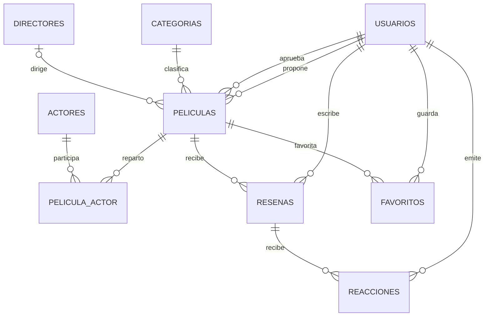

# Modelo entidad-relación

```mermaid
erDiagram
 USUARIOS ||--o{ PELICULAS : propone
 USUARIOS ||--o{ PELICULAS : aprueba
 CATEGORIAS ||--o{ PELICULAS : clasifica
 DIRECTORES o|--o{ PELICULAS : dirige
 PELICULAS ||--o{ PELICULA_ACTOR : reparto
 ACTORES ||--o{ PELICULA_ACTOR : participa
 USUARIOS ||--o{ RESENAS : escribe
 PELICULAS ||--o{ RESENAS : recibe
 USUARIOS ||--o{ REACCIONES : emite
 RESENAS ||--o{ REACCIONES : recibe
 USUARIOS ||--o{ FAVORITOS : guarda
 PELICULAS ||--o{ FAVORITOS : favorita
```
