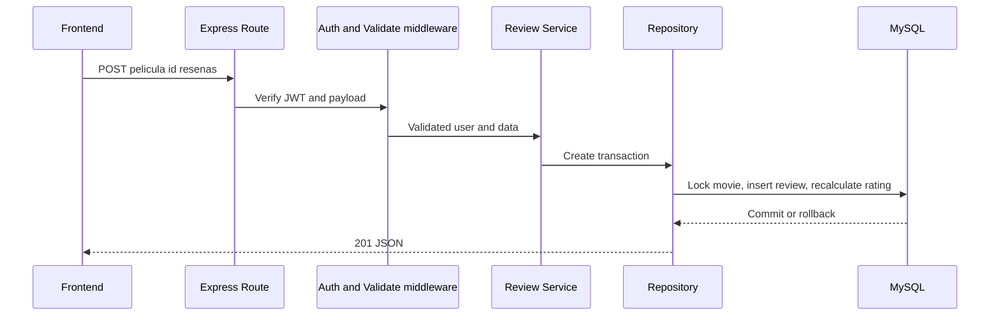

# Secuencia de reseña

```mermaid
sequenceDiagram
 participant F as Frontend
 participant R as Express Route
 participant M as Auth and Validate middleware
 participant S as Review Service
 participant Repo as Repository
 participant DB as MySQL
 F->>R: POST pelicula id resenas
 R->>M: Verify JWT and payload
 M->>S: Validated user and data
 S->>Repo: Create transaction
 Repo->>DB: Lock movie, insert review, recalculate rating
 DB-->>Repo: Commit or rollback
 Repo-->>F: 201 JSON
```
